# Scenario 1

**Data scientists wants to easily store, download, access and visualize large data sets in their ML projects.**

The challenges they face are: 
1. Any time there’s a file in git that’s >25MB, the git process grinds to a halt
2. There isn't a tool right now that can easily explore visualizations of large data sets.
3. Accessing data in which way is a puzzle unsolved. Whether it's from S3, Spark, or downloading from GitHub, there isn't a unified product solution to address various accessing needs.

Here's the **Git for Data** experience to solve the issues of a data scientist Sarah:


- Sarah chooses a repo they want to work with.
    - The repo has code in it but no data
    - The data is hosted on an S3 blob


- Sarah choses to clone the repo.
- At the same time the repo is cloned, it also gives an option to copy the data to a new bucket. This is how Sarah can copy data used in the original repo based.
- Sarah wants to work with the data locally, so she explicitly pulls down the data, updates any pointers (via shims) so that the scripts still work, but now point at local data
Git could be extended via ‘add-ons’ using a mechanism like this -https://github.com/stevemao/awesome-git-addons
  


- Sarah checks out a new branch, and the tool locks and changes the data
- Data is now pointing to branch specific data
  

- Sarah wants to explore the data a bit.
- She uses a built-in library to do visualize the data:
    - Something like facets (https://pair-code.github.io/facets/ ) would be great
    - Could also generate widgets that appear in the Jupyter Notebook

  

- She also wants to add an additional file and changes her data.
- Data is automatically ignored by git and pushed to datastore for you as if though you are storing data in GitHub, with the same commands git add and git push.
- All pointers are correctly updated 
    - Would the pointers to the data change? E.g. should it point at a historical commit of the data, instead of just to a file?

  

# Scenario 2

A data scientist wants to get started with a large open data set which cannot be worked on locally.

### [luzhan] Should the dataset be mounted to the cloud compute? We should only allow users to download samples if they want to work locally.

#### Pre-req:

- User already has an account with a cloud that provides an S3-compatible blob store
- User has already installed github_data

#### Steps:
- Sarah chooses to start working using an open data set such as satellite data.
- The data set is very large, too large to work with locally.
She doesn’t care what cloud she uses, but she’ll need to make a copy of the dataset – the source files are both remote (meaning training will be slow) and unusable (they’re in tarball format)
- She clones the repo, and it prompts her to select a cloud (or choose her own)

  

#### Steps:
- During the copy, the developer has an option to create multiple types of objects are created:
    - A “sampled” and “full” data set
    - Initialization of a data version
    - Collaboration scaffold (e.g. PR structure)
    - Statistics, schemas and examples
    - DataValidation rules (based on contents)
- Using compute already associated with the project, she runs schema, statistics and example generators (free for <10 GB?)
- Examples of how this works comes from TFX 
    - SchemaGen - https://www.tensorflow.org/tfx/guide/schemagen
    - Schema Gen also auto-grenerates DataValidation rules - https://www.tensorflow.org/tfx/guide/tfdv
    - StatisticsGen - https://www.tensorflow.org/tfx/guide/statsgen
    - ExampleGen - https://www.tensorflow.org/tfx/guide/examplegen
- This generates files that are small enough to use locally for training and improves visualization. It does not require downloading very large data sets.
- The statistics, schemas and examples are all added to the project’s repo automatically. 
  

#### Steps:
- Sarah wants to add a second large data set to the existing repo.
She goes to the National Weather Service site (nws) and chooses a snapshot to grab.
- She then adds it to her existing data sources for her project
  

#### Steps:
- Both data sets have been added to the repo, but they’re still too large to download. The developer wants to analyze them, so she issues a command to download the necessary statistics & schemas to her local machine.
- She is able to browse the information and choose relevant features

# Scenario 3
A data scientist Sarah wants to use her framework of choice to track training and logs experiments locally.

#### Pre-req:

- Sarah wants to use local Jupyter notebook to write and run her training code.
- She is using some APIs (e.g. mlflow, wandb, tensorboard, etc.) to track the experiment in her current folder.

## Workflow 3a:

- Sarah starts nteract (a Jupyter UI)
- She imports ‘octostore’, an open source library designed to make interacting with data easy
- She uses octostore to import the data from the source – at this point octostore begins a session and starts recording metadata about her run
- Octostore also has the ability to split data according to common techniques (in this case, 70% training and 30% hold back for testing)
  

- She’s now ready to do a full training run
- She’s already used MLFlow in the past, and octostore understands the API – so she doesn’t have to change any code.
- She pastes in the code she used from MLFlow and tweaks it as she needs it.
    - Though MLFlow  will “start its own run”, this takes place inside of the larger “octostore” run already kicked off
- The code is now ready to run
- Octostore also can run the file (in the current python environment) and automatically convert (if necessary) the python notebook.
- All information about the run is stored locally in:
<PROJECT_NAME>/   runs/      <EXPERIMENT_NAME>/        <RUN_ID>/	    [ALL_RUN_FILES]
  

  

- Sarah now wants to evaluate local runs and compare against each other
- The files are written in an MLFlow compliant format so they can be evaluated as well via the MLFlow UI
  

## Workflow 3b:

- After Sarah has set up a working environment as illustrated in Senario 2, she then wants to run some training scripts. In this experiment, she wants to use _random forest_ tree to predict wine quality, and uses __mlflow__ to track the experiment. In her current folder, she has the following items:

```
mlflow/examples/h2o/
   conda.yaml
   random_forest.ipynb
   random_forest.py
   wine-quality.csv
```

- In her training code, she uses __MLflow logging API__ (it could be any popular framworks, metaflow, octostore, etc.) to log metrics and artifacts. 
  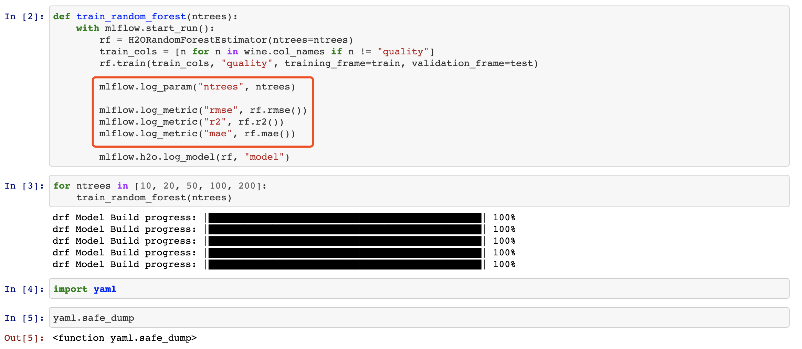

After finish writing the training code, she runs the entire python script by

```
python random_forest.py
```

The metrics and artifacts are stored in the specific folders under the local project folder ```mlflow/examples/h2o/mlruns/```.


   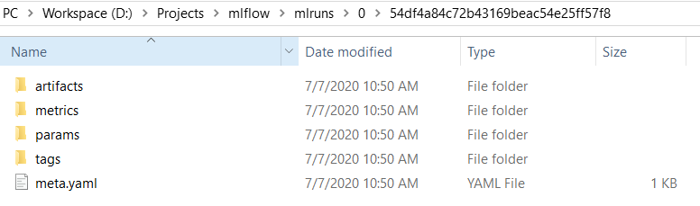


4. Sarah then wants to visualize and compare different runs' results on her local dashboard. To do so, she would run in CLI ```mlflow ui``` which will then host an mlflow GUI dashboard at ```http://localhost:5000```.

   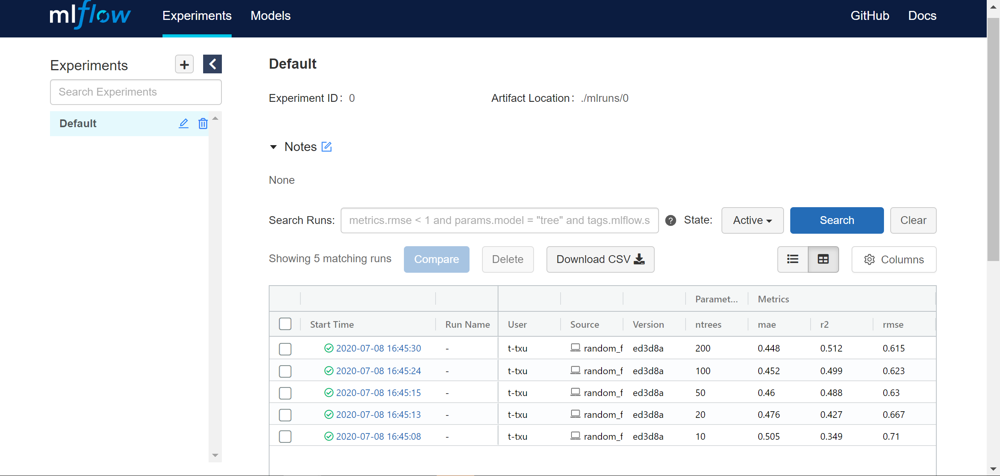

   > Under the "Experiment" tab, she will find 5 runs that she just finished.

# Scenario 4

A data scientist finishes her local experiments and wants to continue working on another device, or share her experiments with others.

#### Pre-req:
- Developer does not have a git repo for the ml project yet, but has already authorized with GitHub
- Developer HAS an environment file, but DOES NOT have a Pipfile (she has been installing python packages using ‘pip’ 
#### Workflow 4a:
- To accomplish smooth transition from one working machine to another, a data scientist can easily package his current environment or dependencies
‘octostore create’ command to auto-detect and generate structure (according to cookie-cutter-datascience)
- Additional commands capture the environment and use git to push to the remote repository.

  

## Workflow 4b:

- After several iterations, she's satisfied with the model. Now she wants to push the project into her GitHub repo so that she can continue working on her laptop when she's back to home. 

- She then uses ```git``` to commit all the changes and pushes to GitHub. 

```bash
$ git add . # or, git add path/to/file
$ git commit -m "some changes"
$ git push

> Enumerating objects: 11, done.
> Counting objects: 100% (11/11), done.
> Delta compression using up to 12 threads
> Compressing objects: 100% (9/9), done.
> Writing objects: 100% (9/9), 1.89 MiB | 944.00 KiB/s, done.
> Total 9 (delta 0), reused 0 (delta 0)
> To https://github.com/tichx/mlworkflow.git
> d46339e..ac8e73d  master -> master
```

- (Optional) Then, she also wants to share the environment that the code runs in, in which case she will need to package her environment again like Senario 1 and push to GitHub. If the environment has changed, ```hub env-package``` will notify the changes and kindly remind what to be tracked. 

```bash
# scan and generates setup file **
$ hub package-env 
> Found 3 environment files modified in /mlruns/
    - 3 changes in /mlruns/artifacts
    - 29383 insertions in /mlruns/experiments
    - 12 deletions in /mlruns/metrics
> Do you want to package them? y/n: y
> done.

# lastly, add, commit, and push to GitHub
$ git add . 
$ git commit -m "packaged env"
$ git push
```

In case of forgetting this step, she will also see a reminder on GitHub Action since any commit push is a part of automatic workflow that triggers detection of environment changes.

- From the GitHub repo, she can see all the previous local run metrics/results from the Insights tab thanks to the environment packaging.
  - Under __Insights__ tab, she will find the highlights of 200 runs tracked by MLflow visualized here for a quick glance.
    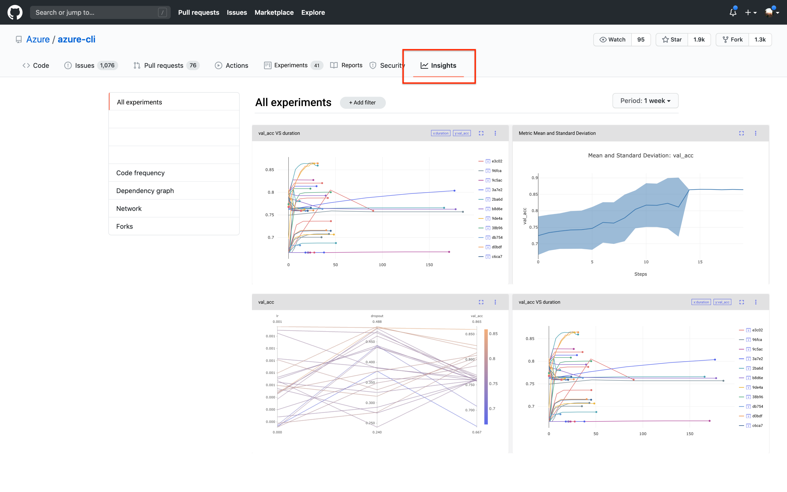

  - Then, jumping to __Experiments__, each experiment is shown in the grid. To investigate a specific experiement, she can click on the experiment ID, which will directs her to the deatil page.
    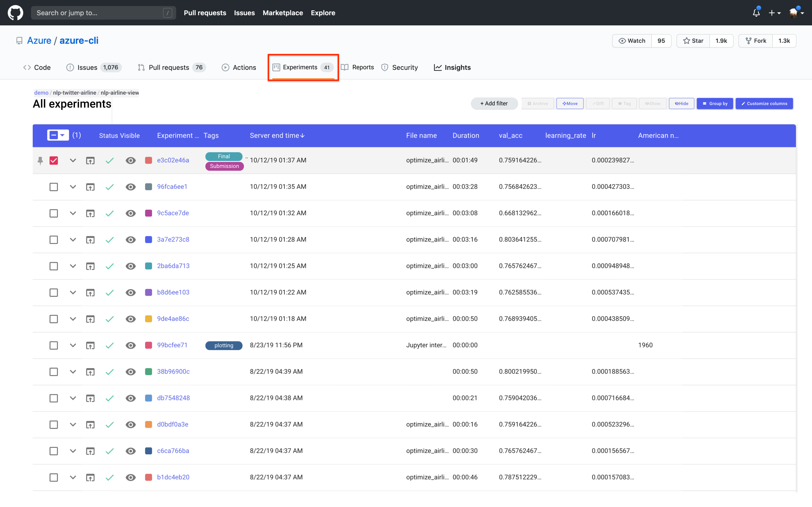

  - Here, she can customize the charts and find key information about this run.
    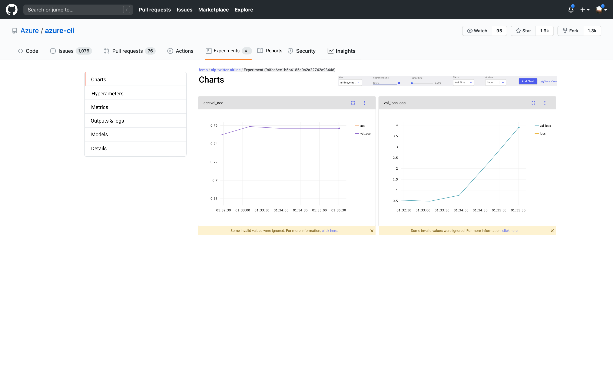

  - Also, hyperameters will be documented here with the help of metadata service record.
    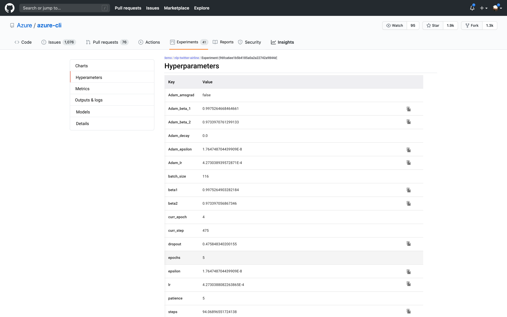

  - Additionally, an output and log page will allows her to see the experiment-specific outputs directly at the repo.

# Scenario 5
A data scientist wants to start working on an existing repo without worrying about environment setup, dependency installations, etc.
#### Pre-req:
- A second developer wants to reproduce the environment cleanly
The repo has already been set up, and she just needs to download and replicate
#### Steps:
- The developer clones the repo locally as normal
- Once inside the repo, she uses ‘octostore’ up to execute the following commands:
    - Detect Pipfile, requirements.txt or other python environment file and create a virtual python environment
    - Detect an environment.yml file and create a conda environment
  

- The environment is cloned, but Sarah is warned the requirements of the model do not match the local environment.
- She decides to move to codespaces.
    
  - QUESTION: How do we do this in a ‘cloud neutral’ way? Other clouds need to be able to participate or we will have limited uptake.


  Then the user will be prompted to log in at GitHub

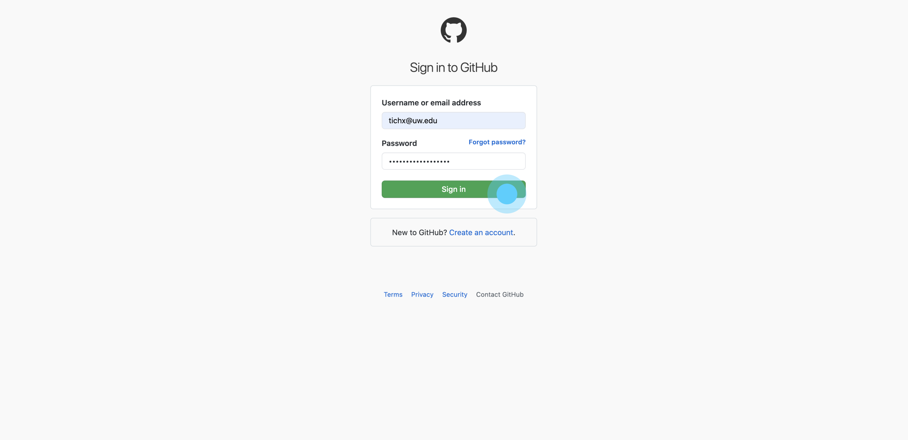

Choose an appropriate compute resource. (Ideally, we would recommend an option based on his project. The screen here is only for demo purpose. The pricing details will also be considered on another occasion.)

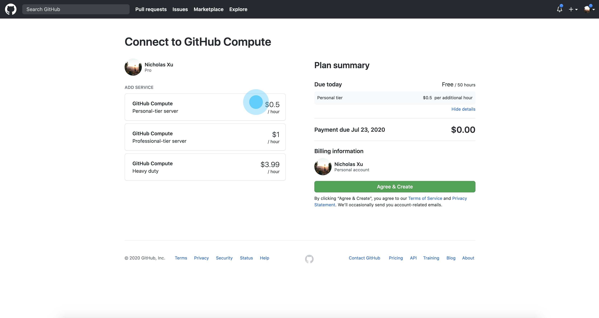

After an option is selected, the user would then choose 'agree & create' to proceed.

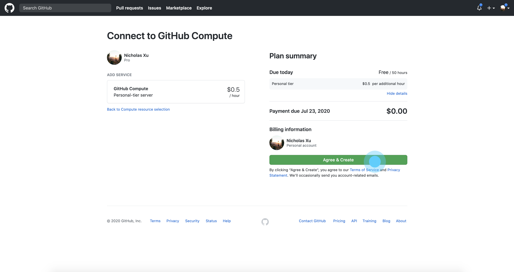

Then the user will be either directed to open a Codespace tab online, or be asked to open Visual Studio on his machine. By clicking 'Connect' he will be able to edit the code and run experiment on the GitHub Compute.

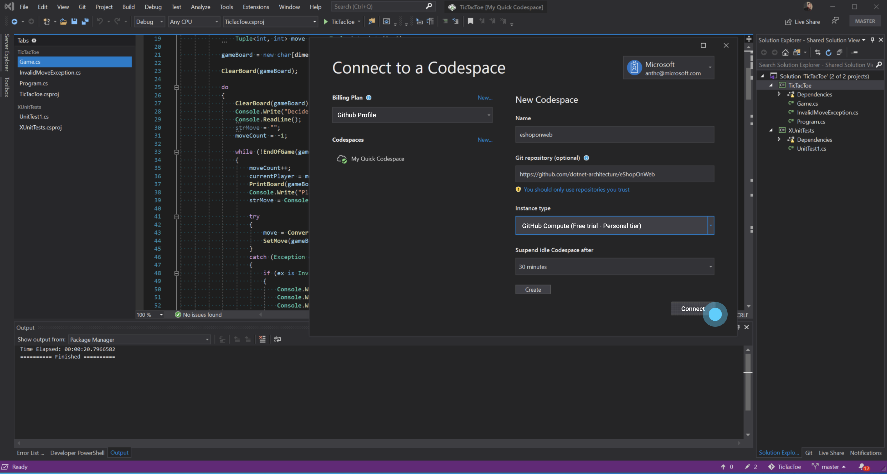